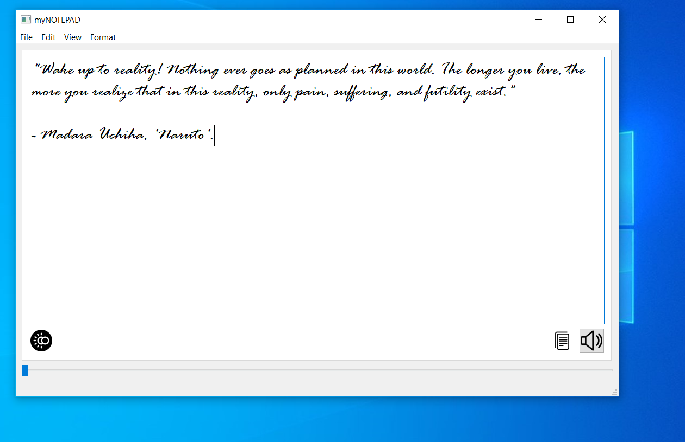
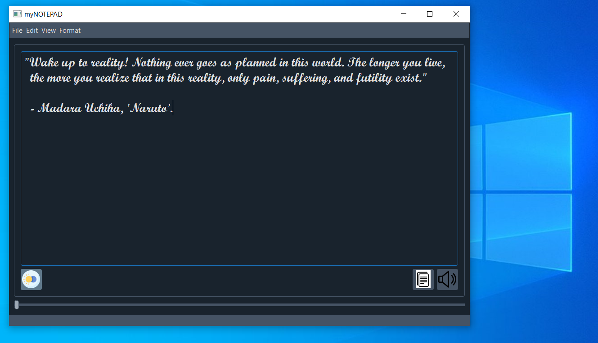
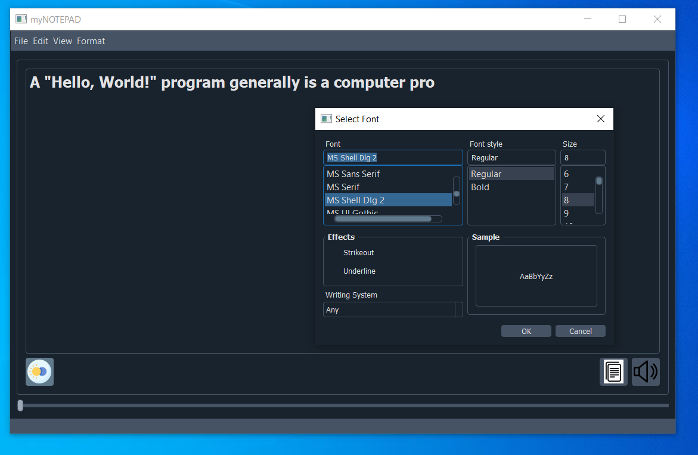
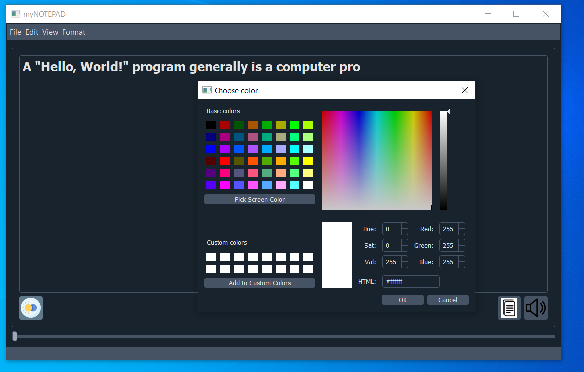
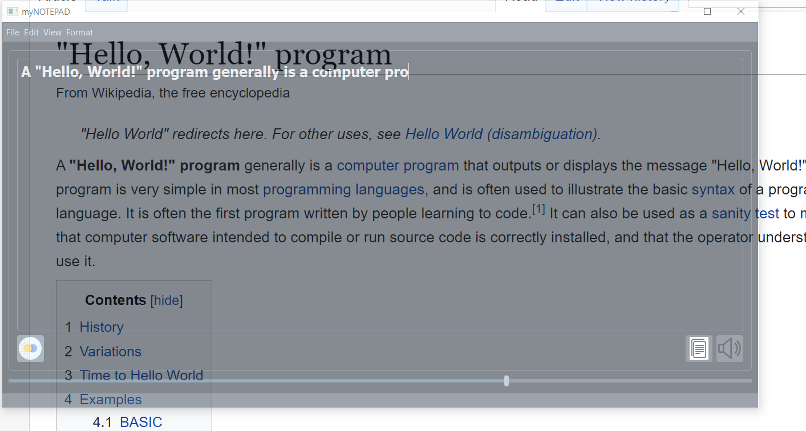

# Notepad

## Features

### 1. Bright Mode:

### 2. Dark Mode:

### 3. Font Format Option:

### 3. Color Format Option:

### 4. Transparency:

   * Cross-Platform Application, run on windows, linux, macOS, Android.

   * Speak button to say entire text written on notepad to user.

   * Copy button to copy entire text in one click.

## Technology Stack

[QT Creater 4.13.1](https://www.qt.io/product/development-tools)

[QTextToSpeech](https://doc.qt.io/qt-5/qtexttospeech.html)

[QMessageBox](https://doc.qt.io/qt-5/qmessagebox.html)

[QSound](https://doc.qt.io/qt-5/qsound.html)

[QFile](https://doc.qt.io/qt-5/qfile.html)

[QFileDialog](https://doc.qt.io/qt-5/qfiledialog.html)

## Setup Files

[setup file for windows](https://github.com/amit-c-ai/Notepad/blob/master/Executables/release/installer/amiNotepadsetup.exe?raw=true)

[setup file for linux](https://github.com/amit-c-ai/Notepad/blob/master/Executables/notepad_opti.zip?raw=true)

(Can also work on macOS(require one time compilation on macOS) and Android)
